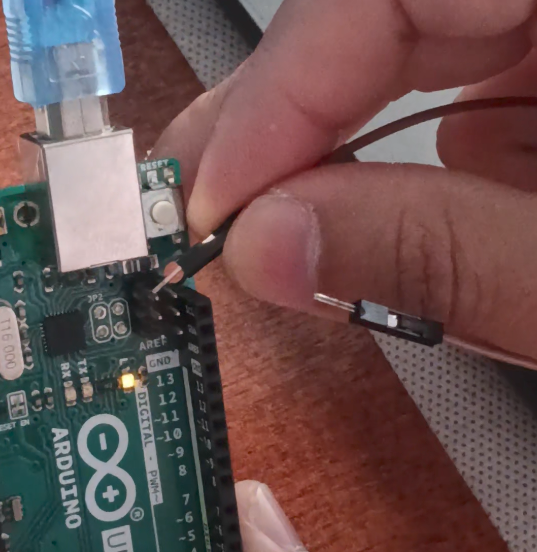

# Rubber Ducky con Arduino

**Autor:** Walther Curo  
**Plataforma:** GNU/Linux (Debian/Ubuntu, Fedora, Arch)  
**Dispositivos:** Arduino UNO R3 (ATmega16U2) y compatibles (ATmega8U2)

Este proyecto proporciona un **script Bash interactivo** (`Arducky.sh`) que automatiza por completo el ciclo de trabajo DFU del microcontrolador USB (16U2/8U2) en placas Arduino UNO R3 y derivadas:

- Instalación de **dfu-programmer** (desde repositorios o compilación automática si no existe).
- Detección/espera del **modo DFU**.
- **Erase** tolerante a `rc=5` (caso típico en 16U2).
- **Flasheo** del firmware **ORIGINAL** (USB-Serial) o **Rubber Ducky** (HID teclado).
- Diagnóstico del **estado de puertos** con `lsusb`:
  - `DFU` (listo para flashear)
  - `RUBBER` (HID teclado activo)
  - `SERIAL` (Arduino USB-Serial)
  - `NONE` (no detectado)

> ⚠️ **Aviso legal:** El modo HID simula un teclado y puede enviar pulsaciones sin intervención humana. Este software debe usarse únicamente en entornos controlados, educativos, de pruebas en laboratorio o con autorización expresa y por escrito del propietario del equipo. El uso indebido podría ser ilegal en su jurisdicción, usarlo bajo su responsabilidad.

---


## Requisitos

- **Linux** con Bash 4+ y `sudo`.
- **`usbutils`** para `lsusb` (recomendado y necesario para la opción 6).
- **`dfu-programmer`** (el script lo instala o compila automáticamente).
- Permisos para acceder a dispositivos USB (DFU) y serial (si aplica).

Instalación manual de utilidades base:

```bash
# Debian/Ubuntu
sudo apt update && sudo apt install -y usbutils

# Fedora
sudo dnf install -y usbutils

# Arch
sudo pacman -Sy --noconfirm usbutils
```

---

## Instalación

Clona el repositorio y prepara el script:

```bash
git clone https://github.com/walthercurodelacruz/Arducky.git
cd Arducky
chmod +x Arducky.sh
./Arducky.sh
```

---

## Archivos HEX requeridos

Coloca junto al script **dos** archivos `.hex` **con exactamente estos nombres**:

- `Arduino-COMBINED-dfu-usbserial-atmega16u2-Uno-Rev3.hex`  ← **ORIGINAL** (USB-Serial)
- `Arduino-keyboard-0.3.hex`                                 ← **Rubber Ducky** (HID Teclado)

---

## Uso

```bash
./Arducky.sh
```

- **0) Configuración** — Cambia timeout DFU, chip forzado (`auto|atmega16u2|atmega8u2`), verbose.  
- **1) Instalar dfu-programmer** — Desde gestor o compilar fuente.  
- **2) Activar modo DFU** — Puentea los pines RESET↔GND por menos de un segundo.
- **3) Limpiar flash** — `erase` tolerante a `rc=5`.  
- **4) Instalar ORIGINAL** — Flasheo con protección de bootloader.  
- **5) Instalar RUBBER DUCKY** — Flasheo HID teclado.  
- **6) Ver estado puertos** — `lsusb` y clasificación.

---



## Solución de problemas

- **`no device present`** → Verifica DFU, chip forzado y cables.  
- **`Permission denied`** → Agrega usuario a grupo `dialout` o similar.  
- **`lsusb` no encontrado** → Instala `usbutils`.  
- **Falla flasheo** → Opción 3 (Erase) y reintentar.  
- **Compilación falla** → Instala build-deps mostradas.

---

## Compatibilidad probada

- Debian/Ubuntu — apt  
- Fedora 41/42/43/44 — dnf/dnf5  
- Arch Linux — pacman

---

## Licencia

Este proyecto está licenciado bajo la **Licencia MIT**:

```text
MIT License

Copyright (c) 2025 Walther Curo

Permission is hereby granted, free of charge, to any person obtaining a copy
of this software and associated documentation files (the “Software”), to deal
in the Software without restriction, including without limitation the rights
to use, copy, modify, merge, publish, distribute, sublicense, and/or sell
copies of the Software, and to permit persons to whom the Software is
furnished to do so, subject to the following conditions:

El aviso de copyright anterior y este aviso de permiso deberán incluirse en
todas las copias o partes sustanciales del Software.

EL SOFTWARE SE PROPORCIONA “TAL CUAL”, SIN GARANTÍA DE NINGÚN TIPO, EXPRESA O
IMPLÍCITA, INCLUYENDO PERO NO LIMITÁNDOSE A GARANTÍAS DE COMERCIALIZACIÓN,
IDONEIDAD PARA UN PROPÓSITO PARTICULAR Y NO INFRACCIÓN. EN NINGÚN CASO LOS
AUTORES O TITULARES DEL COPYRIGHT SERÁN RESPONSABLES POR NINGUNA RECLAMACIÓN,
DAÑO U OTRA RESPONSABILIDAD, YA SEA EN UNA ACCIÓN DE CONTRATO, AGRAVIO O
CUALQUIER OTRA FORMA, DERIVADA DE O EN CONEXIÓN CON EL SOFTWARE O EL USO U
OTROS TRATOS EN EL SOFTWARE.
```

---

## Apéndice A — Comandos manuales

```bash
# Detectar DFU
sudo dfu-programmer atmega16u2 get

# Borrado (erase) + reset
sudo dfu-programmer atmega16u2 erase
sudo dfu-programmer atmega16u2 reset

# Flashear ORIGINAL
sudo dfu-programmer atmega16u2 flash --suppress-bootloader-mem Arduino-COMBINED-dfu-usbserial-atmega16u2-Uno-Rev3.hex
sudo dfu-programmer atmega16u2 reset

# Flashear HID (Rubber Ducky)
sudo dfu-programmer atmega16u2 flash Arduino-keyboard-0.3.hex
sudo dfu-programmer atmega16u2 reset
```

---
